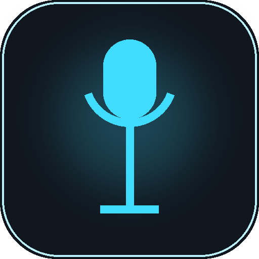
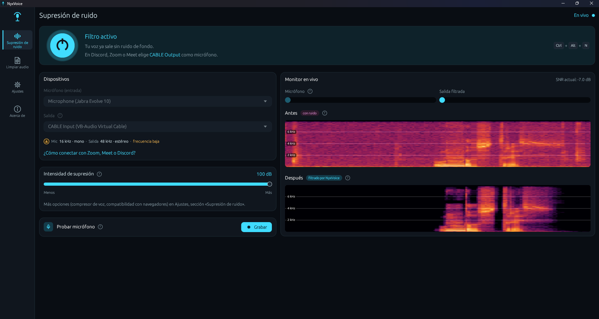
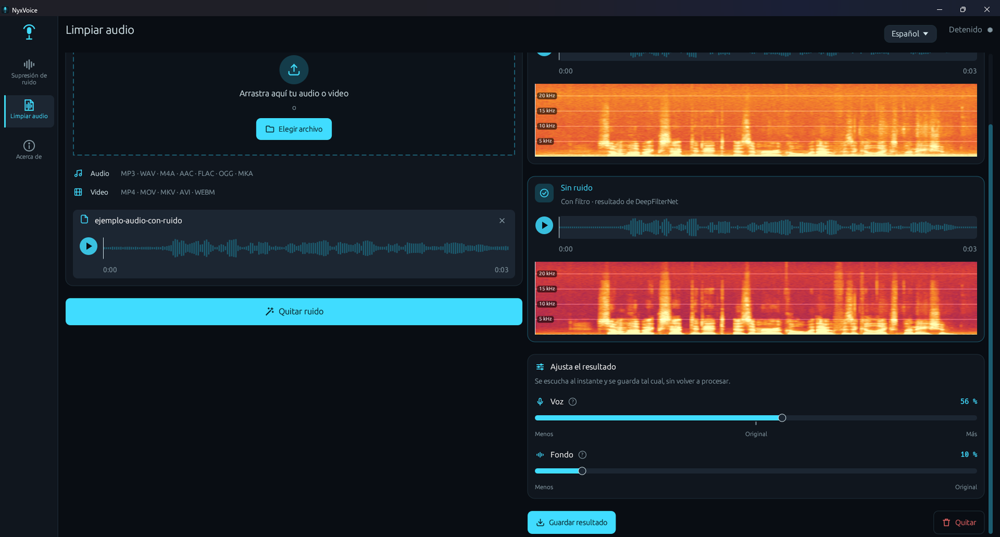

  

<h1 align="center">NyxVoice</h1>

  <b>Elimina el ruido de fondo de tu micrófono en tiempo real, con inteligencia artificial.</b> 
  Gratis · Para Windows · Funciona sin tarjeta gráfica

  

  
  
  
  

> **English:** NyxVoice is a free Windows app that removes background noise from your microphone in real time using AI (DeepFilterNet). It also cleans audio and video files. Works with Discord, Zoom, Google Meet, OBS and more. Created by **Nyxtard** (Carlos Navío Salcedo).

---

## 🎧 Escucha la diferencia

  
  https://github.com/user-attachments/assets/e832b84b-fe4f-4af2-b778-f19f41755deb

La misma grabación, antes y después de pasar por NyxVoice. En las pausas, el ruido de fondo baja de **−34 dB a −83 dB**: prácticamente desaparece, y la voz se mantiene natural.

🔊 Archivos de ejemplo: [antes (con ruido)](demo/antes-con-ruido.wav) · [después (con NyxVoice)](demo/despues-con-nyxvoice.wav)

---

## ✨ Qué hace

**Supresión de ruido en vivo**
- Quita en tiempo real ventiladores, teclado, mouse, aire acondicionado, tráfico, mascotas y otros ruidos de fondo.
- Intensidad ajustable: desde una limpieza suave hasta eliminar todo el ruido.
- **Compresor de voz** opcional, para un volumen más parejo.
- **Compatibilidad con navegadores** (opcional, apagada por defecto): solo para un caso especial; ver [preguntas frecuentes](#-preguntas-frecuentes).
- **Probar micrófono**: graba tu voz y escucha la diferencia con y sin filtro.
- Espectrogramas en vivo para ver el ruido antes y después.

  

**Limpiar audio** (archivos y grabaciones)
- Limpia **audios**: MP3, WAV, M4A, AAC, FLAC, OGG y MKA.
- Limpia **videos**: MP4, MOV, MKV, AVI, WEBM y M4V. Mantiene la imagen original y solo cambia el sonido.
- Sin límite de duración: sirve para podcasts, clases o streams de horas.
- Videos con varias pistas de audio: eliges cuál limpiar.
- Puedes grabar directamente desde la app y escuchar el antes y después antes de guardar.

  

**Privado:** todo se procesa en tu PC. Tu voz nunca se sube a internet.

---

## 📥 Descargar e instalar

1. Ve a [**Releases**](https://github.com/Nyxtard/NyxVoice/releases/latest) y descarga **`NyxVoice-Setup-0.1.0.exe`**.
2. Ábrelo y sigue los pasos del instalador.
3. Si Windows muestra **"Windows protegió tu PC"**, haz clic en **"Más información"** → **"Ejecutar de todas formas"**. Ver [preguntas frecuentes](#-preguntas-frecuentes).

**Requisitos:** Windows 10 u 11 de 64 bits. No necesita tarjeta gráfica.

**Para actualizar:** instala la versión nueva encima; no hace falta desinstalar la anterior.

---

## 🎮 Usarlo en Discord, Zoom, Meet, OBS…

Para que otras apps escuchen tu voz ya limpia, NyxVoice usa un **cable de audio virtual** gratuito.

1. Instala [**VB-Audio Virtual Cable**](https://vb-audio.com/Cable/) (gratis). El instalador de NyxVoice te ofrece abrir su página si no lo tienes.
2. En NyxVoice:
   - **Micrófono (entrada):** tu micrófono real.
   - **Salida:** **CABLE Input (VB-Audio Virtual Cable)**.
   - Pulsa **Activar**.
3. En Discord, Zoom, Meet u OBS, elige como micrófono **CABLE Output (VB-Audio Virtual Cable)**.

Listo: todos te escucharán sin ruido de fondo. La app también tiene una guía integrada: **"¿Cómo conectar con Zoom, Meet o Discord?"**.

> 💡 En Discord, si usas NyxVoice, puedes desactivar su propia supresión de ruido (Krisp) para no filtrar dos veces.

---

## ❓ Preguntas frecuentes

<b>¿Es gratis?</b>

Sí, NyxVoice es gratis. Si te sirve, puedes apoyarme en [Ko-fi](https://ko-fi.com/nyxtard) 💜

<b>¿Por qué Windows dice "Windows protegió tu PC"?</b>

Porque NyxVoice todavía no tiene una firma digital de pago (certificado de código). Es normal en apps nuevas e independientes. Haz clic en **"Más información"** → **"Ejecutar de todas formas"**. Descarga NyxVoice solo desde esta página oficial.

<b>¿Necesito una tarjeta gráfica NVIDIA o AMD?</b>

No. NyxVoice funciona con el procesador (CPU) de cualquier PC moderna.

<b>¿Quita el eco de la habitación?</b>

No. NyxVoice elimina el **ruido de fondo**, pero no el eco o reverberación de la habitación. Para evitar que tu micrófono capte el sonido de tus parlantes, usa audífonos.

<b>¿Para qué sirve "Compatibilidad con navegadores"?</b>

Es una opción **especial y apagada por defecto**. **Actívala solo si te pasa esto:** al hablar o grabar desde una **página web** (por ejemplo Google Meet en el navegador) mientras tu PC reproduce otro sonido (un video de YouTube, música…), se escucha un **chillido**.

Pasa con algunos audífonos, como el **Jabra Evolve 10**: parte del sonido de los audífonos llega al micrófono, y el cancelador de eco del navegador confunde tu voz con eco. Esta opción mantiene tu voz a un volumen fuerte y constante para que el navegador la reconozca como voz.

**Si no te pasa, no la uses.** Tampoco hace falta en apps de escritorio como Discord, Zoom u OBS.

<b>¿Mi voz se sube a internet?</b>

No. Todo se procesa en tu PC, sin conexión.

<b>¿Cómo lo desinstalo?</b>

Desde **Configuración de Windows → Aplicaciones → NyxVoice → Desinstalar**.

---

## 💜 Apoya el proyecto

NyxVoice es gratis y lo hago en mi tiempo libre. Si te ayudó, puedes invitarme un café:

  

Desde Perú también puedes apoyar con **Yape** o **transferencia BCP**: los datos están dentro de la app, en **Acerca de → Apoyar NyxVoice**.

---

## 👤 Autor

Creado por **Nyxtard** (**Carlos Navío Salcedo**).

- GitHub: [@Nyxtard](https://github.com/Nyxtard)
- Ko-fi: [ko-fi.com/nyxtard](https://ko-fi.com/nyxtard)

---

## 📄 Licencia y créditos

NyxVoice es gratuito, pero **no es de código abierto**: © 2026 Nyxtard (Carlos Navío Salcedo). Todos los derechos reservados. Consulta los [términos de uso](LICENCIA-NYXVOICE.txt).

NyxVoice funciona gracias a estos proyectos de código abierto:
- [**DeepFilterNet**](https://github.com/Rikorose/DeepFilterNet): el modelo de inteligencia artificial que elimina el ruido (licencias MIT / Apache 2.0).
- [**FFmpeg**](https://ffmpeg.org) 8.1.3: para leer y guardar videos. Compilación LGPL v3 de [BtbN/FFmpeg-Builds](https://github.com/BtbN/FFmpeg-Builds); [código fuente de esta versión](https://github.com/FFmpeg/FFmpeg/tree/n8.1.3).
- Y otras librerías listadas en [LICENCIAS-DE-TERCEROS.txt](LICENCIAS-DE-TERCEROS.txt).

---

  NyxVoice · supresor de ruido para micrófono · eliminar ruido de fondo · cancelación de ruido con IA · noise suppression · noise cancelling · Windows · Discord · Zoom · OBS · por Nyxtard

