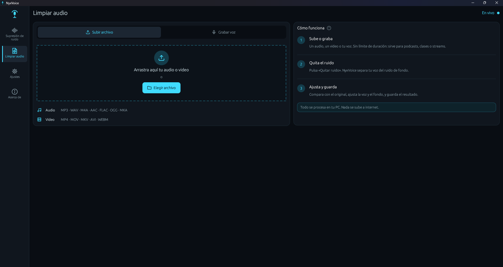

  

<h1 align="center">NyxVoice</h1>

  <b>Elimina el ruido de fondo de tu micrófono en tiempo real, con inteligencia artificial.</b> 
  Gratis · Para Windows · Funciona sin tarjeta gráfica

  

  
  
  
  

> **English:** NyxVoice is a free Windows app that removes background noise from your microphone in real time using AI (DeepFilterNet). It also cleans audio and video files, runs quietly in the system tray and has a global hotkey (Ctrl + Alt + N). Works with Discord, Zoom, Google Meet, OBS and more. Created by **Nyxtard** (Carlos Navío Salcedo).

---

## 🎧 Escucha la diferencia

  
  https://github.com/user-attachments/assets/e832b84b-fe4f-4af2-b778-f19f41755deb

La misma grabación, antes y después de pasar por NyxVoice. En las pausas, el ruido de fondo baja de **−34 dB a −83 dB**: prácticamente desaparece, y la voz se mantiene natural.

🔊 Archivos de ejemplo: [antes (con ruido)](demo/antes-con-ruido.wav) · [después (con NyxVoice)](demo/despues-con-nyxvoice.wav)

---

## ✨ Qué hace

**Supresión de ruido en vivo**
- Quita en tiempo real ventiladores, teclado, mouse, aire acondicionado, tráfico, mascotas y otros ruidos de fondo.
- **Un solo botón para activarlo**, con el estado a la vista («Filtro activo» / «Filtro apagado») y qué elegir en Discord, Zoom o Meet.
- Intensidad ajustable: desde una limpieza suave hasta eliminar todo el ruido.
- **Monitor en vivo:** medidores de volumen y espectrogramas **Antes** (con ruido) y **Después** (filtrado por NyxVoice).
- **Probar micrófono:** graba unos segundos y compara al instante **con filtro** y **sin filtro**; puedes guardar la grabación.
- **Compresor de voz** opcional, para un volumen más parejo (se muestra desde **Ajustes → Supresión de ruido**).
- **Compatibilidad con navegadores** (opcional): solo para un caso especial; se muestra desde **Ajustes → Supresión de ruido**. Ver [preguntas frecuentes](#-preguntas-frecuentes).

  

**Limpiar audio** (archivos y grabaciones)
- Limpia **audios**: MP3, WAV, M4A, AAC, FLAC, OGG y MKA.
- Limpia **videos**: MP4, MOV, MKV, AVI, WEBM y M4V. Mantiene la imagen original y solo cambia el sonido.
- Sin límite de duración: sirve para podcasts, clases o streams de horas.
- Videos con varias pistas de audio: eliges cuál limpiar.
- **Compara** el original y el resultado con el video a la vista, y mira su **espectrograma** (opcional) para ver cuánto ruido se quitó.
- **Ajusta el resultado al instante**, sin volver a procesar:
  - **Voz:** sube o baja solo la voz, sin subir el ruido.
  - **Fondo:** decide cuánto ambiente conservar, de casi nada al sonido original.
  - **Compresor de voz:** iguala el volumen cuando hay partes más bajas y más fuertes, por ejemplo dos micrófonos distintos.
- Puedes grabar directamente desde la app, escuchar el antes y después, y guardar también tu grabación **sin filtro**.

  

  

**Siempre a mano**
- **Funciona en segundo plano:** al cerrar la ventana, NyxVoice sigue quitando el ruido junto al reloj. Para salir del todo: clic derecho en su ícono → **Salir**.
- **Ícono de estado:** en su color con el filtro activo; en gris con una raya roja, apagado.
- **Atajo Ctrl + Alt + N:** activa o desactiva el filtro desde cualquier programa, incluso en un juego. Muestra un aviso en pantalla y suena un tono corto.
- **Iniciar con Windows** (opcional): se abre escondido junto al reloj, con el filtro ya activado.
- **Aviso de versión nueva:** te avisa cuando hay una actualización.

**Se adapta a tu pantalla**
- Funciona en **media pantalla** de Windows 11, al lado de Discord o de un juego.
- En pantallas chicas o con el escalado de Windows, usa un **modo compacto** automático.
- **Tamaño de la interfaz** ajustable (80 % a 150 %), también con **Ctrl +** y **Ctrl -**.

**Ajustes ordenados por categorías:** Apariencia (idioma y tamaño), Inicio y bandeja, Atajo de teclado, Supresión de ruido, Limpiar audio, y Actualizaciones y ayuda (aviso de versión nueva y un registro de errores para cuando necesites ayuda).

**Privado:** todo se procesa en tu PC. Tu voz nunca se sube a internet.

---

## 📥 Descargar e instalar

1. Ve a [**Releases**](https://github.com/Nyxtard/NyxVoice/releases/latest) y descarga **`NyxVoice-Setup-0.3.0.exe`**.
2. Ábrelo y sigue los pasos del instalador.
3. Si Windows muestra **"Windows protegió tu PC"**, haz clic en **"Más información"** → **"Ejecutar de todas formas"**. Ver [preguntas frecuentes](#-preguntas-frecuentes).

**Requisitos:** Windows 10 u 11 de 64 bits. No necesita tarjeta gráfica.

**Para actualizar:** instala la versión nueva encima; no hace falta desinstalar la anterior.

---

## 🎮 Usarlo en Discord, Zoom, Meet, OBS…

Para que otras apps escuchen tu voz ya limpia, NyxVoice usa un **cable de audio virtual** gratuito.

1. Instala [**VB-Audio Virtual Cable**](https://vb-audio.com/Cable/) (gratis). El instalador de NyxVoice te ofrece abrir su página si no lo tienes.
2. En NyxVoice:
   - **Micrófono (entrada):** tu micrófono real.
   - **Salida:** **CABLE Input (VB-Audio Virtual Cable)**.
   - Pulsa **Activar**.
3. En Discord, Zoom, Meet u OBS, elige como micrófono **CABLE Output (VB-Audio Virtual Cable)**.

Listo: todos te escucharán sin ruido de fondo. La app también tiene una guía integrada: **"¿Cómo conectar con Zoom, Meet o Discord?"**.

> 💡 En Discord, si usas NyxVoice, puedes desactivar su propia supresión de ruido (Krisp) para no filtrar dos veces.

---

## ❓ Preguntas frecuentes

<b>¿Es gratis?</b>

Sí, NyxVoice es gratis. Si te sirve, puedes apoyarme en [Ko-fi](https://ko-fi.com/nyxtard) 💜

<b>¿Por qué Windows dice "Windows protegió tu PC"?</b>

Porque NyxVoice todavía no tiene una firma digital de pago (certificado de código). Es normal en apps nuevas e independientes. Haz clic en **"Más información"** → **"Ejecutar de todas formas"**. Descarga NyxVoice solo desde esta página oficial.

<b>¿Necesito una tarjeta gráfica NVIDIA o AMD?</b>

No. NyxVoice funciona con el procesador (CPU) de cualquier PC moderna.

<b>¿Quita el eco de la habitación?</b>

No. NyxVoice elimina el **ruido de fondo**, pero no el eco o reverberación de la habitación. Para evitar que tu micrófono capte el sonido de tus parlantes, usa audífonos.

<b>¿Para qué sirve "Compatibilidad con navegadores"?</b>

Es una opción **especial y oculta por defecto** (se muestra en **Ajustes → Supresión de ruido**). **Actívala solo si te pasa esto:** al hablar o grabar desde una **página web** (por ejemplo Google Meet en el navegador) mientras tu PC reproduce otro sonido (un video de YouTube, música…), se escucha un **chillido**.

Pasa con algunos audífonos, como el **Jabra Evolve 10**: parte del sonido de los audífonos llega al micrófono, y el cancelador de eco del navegador confunde tu voz con eco. Esta opción mantiene tu voz a un volumen fuerte y constante para que el navegador la reconozca como voz.

**Si no te pasa, no la uses.** Tampoco hace falta en apps de escritorio como Discord, Zoom u OBS.

<b>¿Mi voz se sube a internet?</b>

No. Todo se procesa en tu PC. Lo único que consulta la app en internet es el número de la última versión de NyxVoice en GitHub, para avisarte si hay una actualización; no envía ningún dato tuyo. Puedes desactivarlo en **Ajustes → Actualizaciones y ayuda**.

<b>¿Tengo que tener la ventana abierta?</b>

No. Al cerrar la ventana, NyxVoice sigue funcionando junto al reloj y quitando el ruido. Puedes activar o desactivar el filtro con **Ctrl + Alt + N** o con clic derecho en su ícono. Para salir del todo: clic derecho en el ícono → **Salir**.

<b>¿Cómo sé si el filtro está activo?</b>

Mira el ícono de NyxVoice junto al reloj: **en su color**, el filtro está activo; **en gris con una raya roja**, está apagado. Al usar el atajo también aparece un aviso abajo de la pantalla.

<b>¿Cómo lo desinstalo?</b>

Desde **Configuración de Windows → Aplicaciones → NyxVoice → Desinstalar**.

---

## 💜 Apoya el proyecto

NyxVoice es gratis y lo hago en mi tiempo libre. Si te ayudó, puedes invitarme un café:

  

Desde Perú también puedes apoyar con **Yape** o **transferencia BCP**: los datos están dentro de la app, en **Acerca de → Apoyar NyxVoice**.

---

## 👤 Autor

Creado por **Nyxtard** (**Carlos Navío Salcedo**).

- GitHub: [@Nyxtard](https://github.com/Nyxtard)
- Ko-fi: [ko-fi.com/nyxtard](https://ko-fi.com/nyxtard)

---

## 📄 Licencia y créditos

NyxVoice es gratuito, pero **no es de código abierto**: © 2026 Nyxtard (Carlos Navío Salcedo). Todos los derechos reservados. Consulta los [términos de uso](LICENCIA-NYXVOICE.txt).

NyxVoice funciona gracias a estos proyectos de código abierto:
- [**DeepFilterNet**](https://github.com/Rikorose/DeepFilterNet): el modelo de inteligencia artificial que elimina el ruido (licencias MIT / Apache 2.0).
- [**FFmpeg**](https://ffmpeg.org) 8.1.3: para leer y guardar videos. Compilación LGPL v3 de [BtbN/FFmpeg-Builds](https://github.com/BtbN/FFmpeg-Builds); [código fuente de esta versión](https://github.com/FFmpeg/FFmpeg/tree/n8.1.3).
- Y otras librerías listadas en [LICENCIAS-DE-TERCEROS.txt](LICENCIAS-DE-TERCEROS.txt).

---

  NyxVoice · supresor de ruido para micrófono · eliminar ruido de fondo · cancelación de ruido con IA · noise suppression · noise cancelling · Windows · Discord · Zoom · OBS · por Nyxtard

